# Provision Resources

## Introduction

In this lab you will provision the resources required for this workshop.

Estimated Lab Time: 30 minutes

### Objectives

<!--Provision a stack comprising of an Autonomous Datawarehouse and an Analytics Cloud instance.-->
Provision an Autonomous Datawarehouse instance and an Analytics Cloud instance.

### Prerequisites

- Method 1
    - IDCS Access Token to provision an analytics instance as part of the stack.
    - Necessary permissions to provision the stack in a compartment.

- Method 2
    - Necessary permissions to provision an analytics instance and an autonomous database.

## METHOD 1: Using a Resource Manager Stack

In order to provision an analytics cloud instance as part of a **Resource Manager** stack, an IDCS access token is required. If you don't have the necessary privileges, then proceed to Method 2.

### STEP 1: Obtain IDCS Access Token

1. Login to the OCI console and go the navigation menu using the menu button in the top left.

    

2. Scroll down to the **Governance and Administration** section and under **Identity**, select **Federation**.

    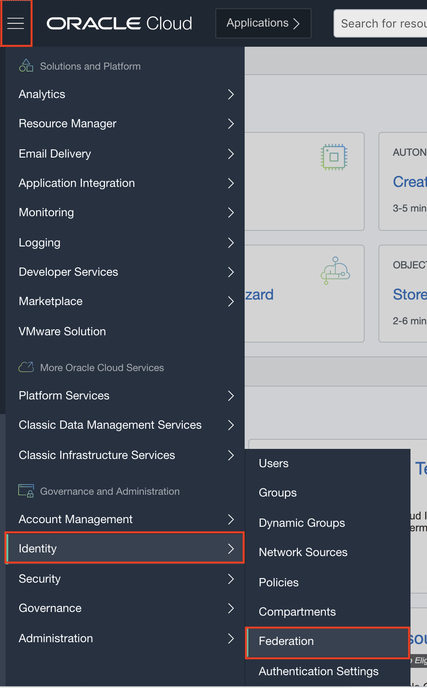

3. Click on the link to the **OracleIdentityCloudService**.

    

4. In the page that opens, click on the Service Console URL.

    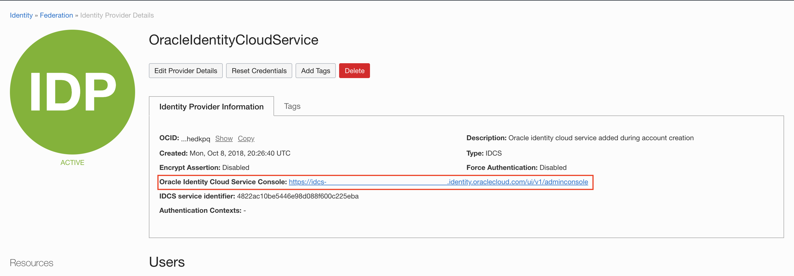

5. In the Identity Cloud Service Console, click on the user icon in the top right corner and select **My Access Tokens**.

    

6. If you have access to the relevant APIs, you should be able to select them, under the **Invokes Identity Cloud Service** radio button. Thereafter, enter the duration of validity of the token in minutes and click on the **Download Token** button.

    

**Note:** If you don't have access to the required APIs, follow **Method 2**.

7. Open the token.tok file that you just downloaded. Keep it handy because in a few minutes you will need to copy the contents of this file.

    

**Note:** You may follow the video [here](https://objectstorage.us-ashburn-1.oraclecloud.com/p/OVQA-GCUjlO9VwEdWqHSre02rNj4K6wZ3VsacpzsXNg/n/oradbclouducm/b/bucket-20200907-1650/o/mdw%20-%20idcs.mp4), if you are unsure of the steps above.

8. You may now close the Identity Cloud Service Console.

### STEP 2: Provision the Stack

1. In the navigation menu, scroll down to the **Solutions and Platform** section. Under **Resource Manager**, select **Stacks**.

    

2. Click on the **Create Stack** button.

    

3. Select the **Sample Solution** radio button. Then, click on the **Select Solution** button.

    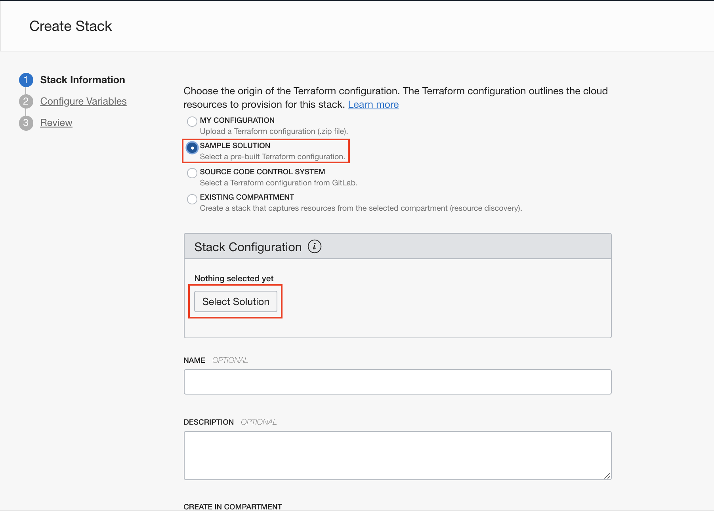

4. In the side menu that opens up, check the **Departmental Data Warehousing** solution and hit the **Select Solution** button.

    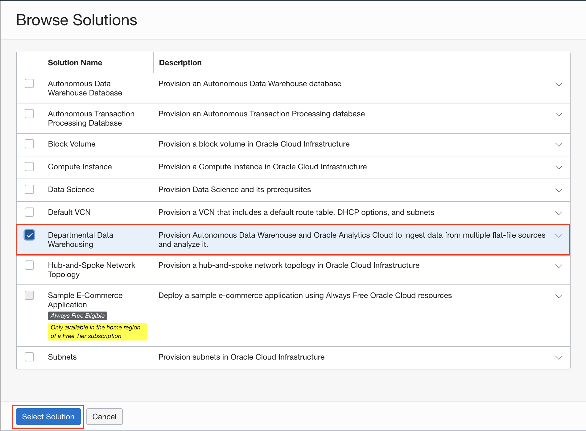

5. Provide a name to the stack and hit **Next**.

    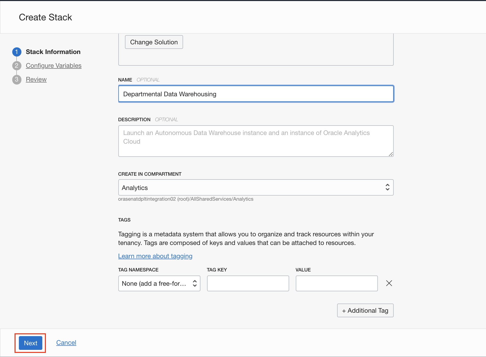

6. On the **Configure Variables** screen, enter the admin password, database name and database display name.

7. Check the **Auto Scaling** box to enable auto-scaling of the database. Enabling this is optional, but recommended. Also, enter 0.0.0.0/0 in the public IP address field.

    

8. Scroll down and provide a name to the analytics instance and paste the access token that you had downloaded, earlier. Now, hit **Next**.

    

9. Review all the details and click on the **Create** button.

    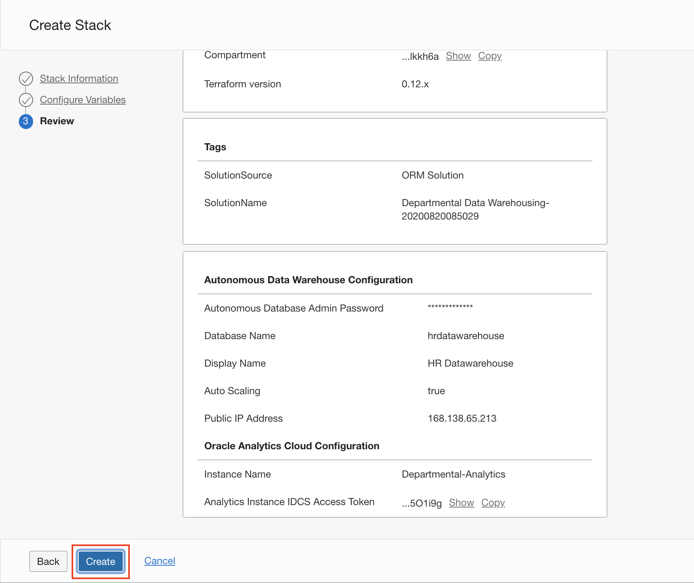

10. Now that the stack has been created, click on **Terraform Actions** and select **Apply**. In the iframe that pops-up, click on **Apply**, again.

    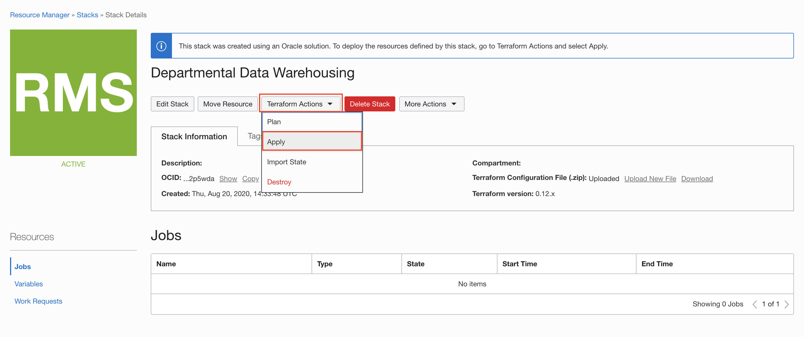

    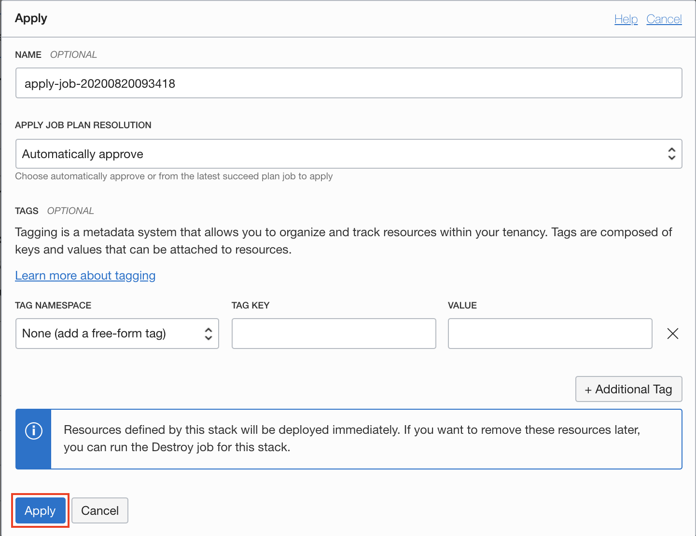

**Note**:  If you have followed the steps above the job should succeed without any issues. Keep an eye on the logs to monitor the progress. If the job fails, please fix the issues and proceed.

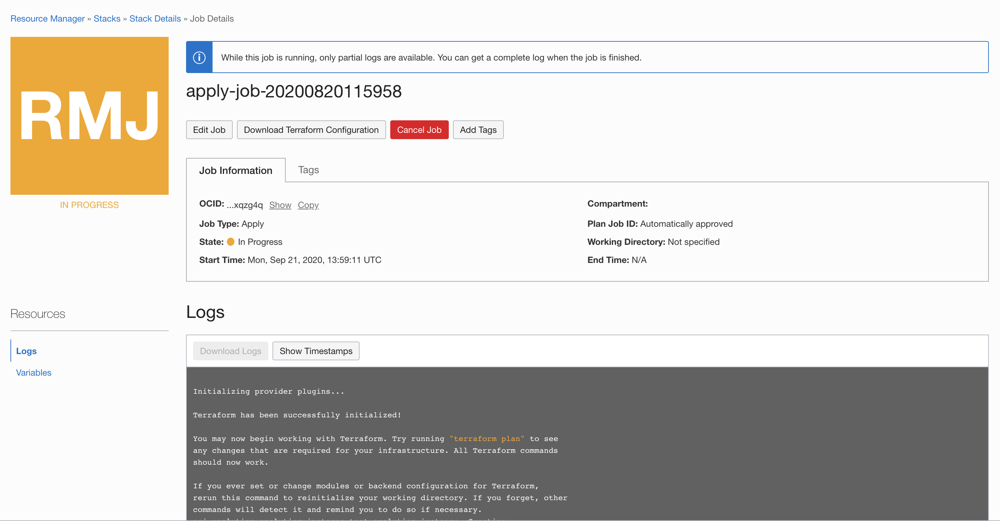

11. If everything goes to plan, you will see the following message at the bottom of the logs.

    

12. On the same page, you will find the **Associated Resources** under the **Reosurces** menu. Click on it to get the links to the provisioned resources.

    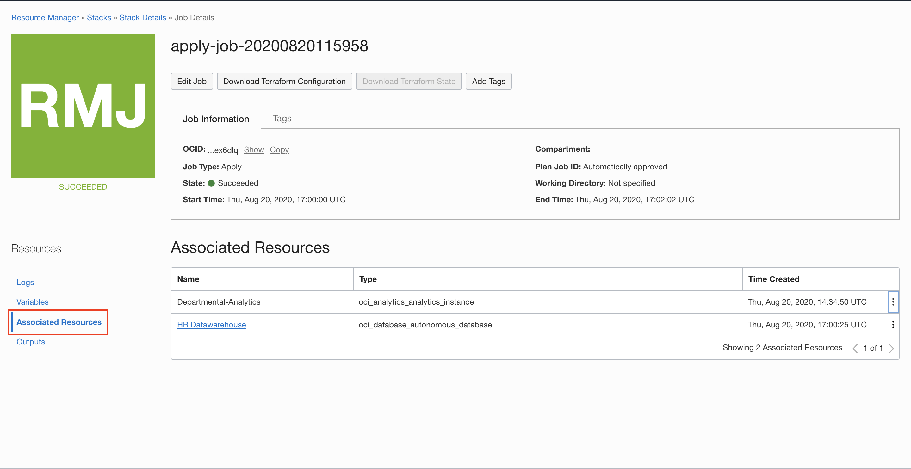

13. Clicking on the links to the resources should take you to their pages.

**Note**: In case there is no link to get to analytics instance, follow the two steps given below, else proceed to the next lab.

14. From the navigation menu, under **Solutions and Platform**, go to **Analytics** and select **Analytics Cloud**.

    

15. Click on the analytics instance to get to its page. Thereafter, click on the **Open URL** button to access the instance.

    

    

## METHOD 2: Independently Provision the Resources

### STEP 1: Provision the Autonomous Data Warehouse

1. Login to the OCI console and go the navigation menu using the Menu button in the top left.

    

2. Choose **Autonomous Data Warehouse** from the **Oracle Database** section.

    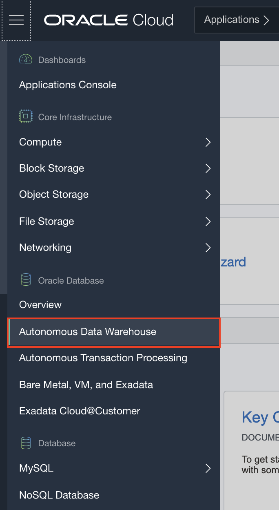

3. Click on the **Create Autonomous Database** button.

    

4. Choose a compartment, enter the **Display Name** and also enter a name for the **Database**. Leave everything else set to the default values.

    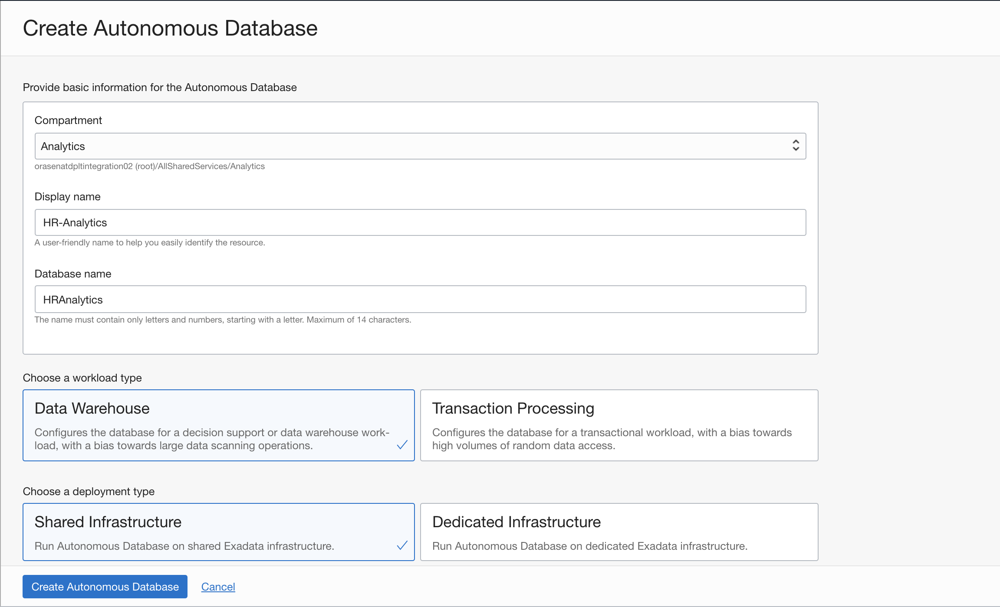

5. Scroll down and provide a password for the administrator.

    

6. Thereafter, hit **Create Autonomous Database**.

    

7. The database should be up and running in a couple of minutes.

    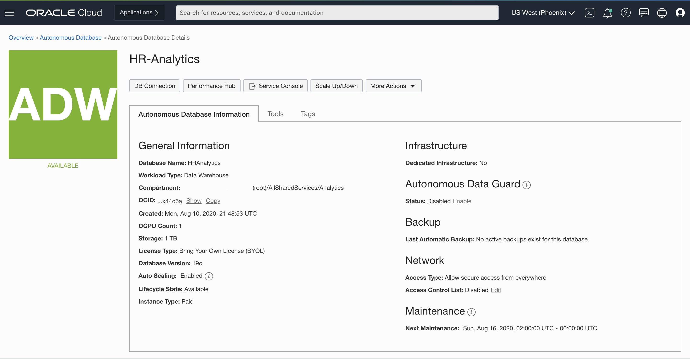

**Note:** Keep this page open or make note of how to get here, since you would need to visit this page for information needed to connect to the database.

### STEP 2: Provision the Analytics Cloud Instance

1. From the navigation menu, under **Solutions and Platform**, go to **Analytics** and select **Analytics Cloud**.

    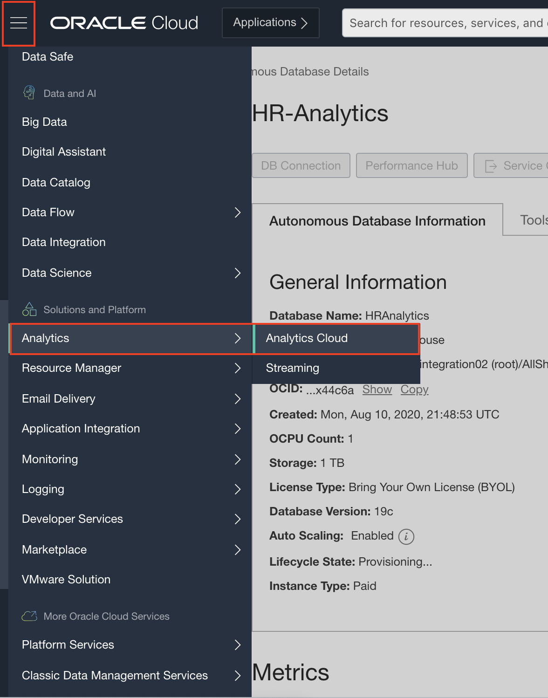

2. On the next page, click on the **Create Instance** button.

    

3. Choose a compartment and provide a name for the instance. Let everything else stay the same. Then click on **Create**.

    

4. The instance will be up in 12-14 minutes. Once the instance is available, click on the **Open URL** button to gain access to the instance.

    

You may now proceed to Lab 2.

## Acknowledgements
- **Author** - Yash Lamba, Cloud Native Solutions Architect, September 2020
- **Last Updated By/Date** - Yash Lamba, September 2020

## See an issue?
Please submit feedback using this [form](https://apexapps.oracle.com/pls/apex/f?p=133:1:::::P1_FEEDBACK:1). Please include the *workshop name*, *lab* and *step* in your request.  If you don't see the workshop name listed, please enter it manually. If you would like for us to follow up with you, enter your email in the *Feedback Comments* section.